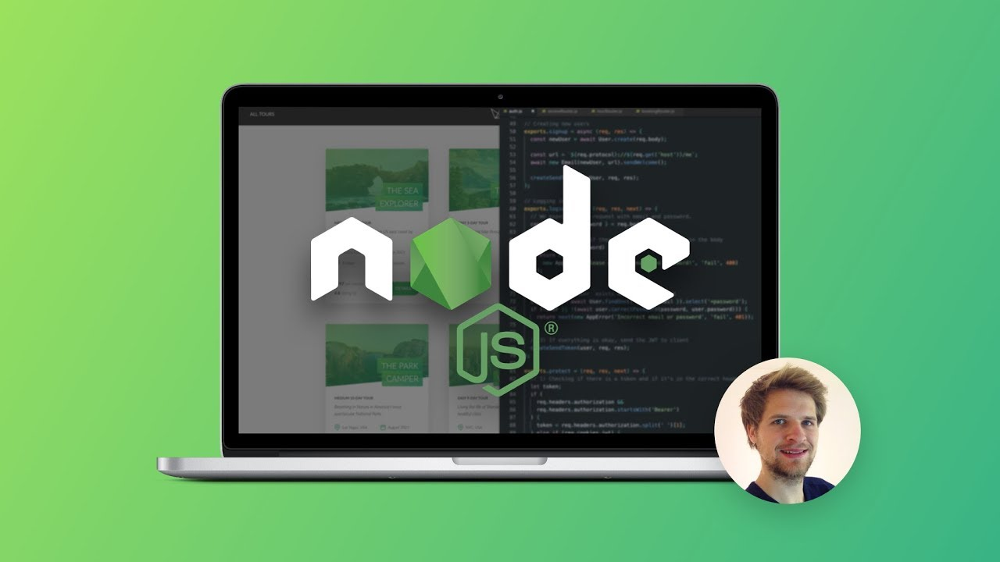

# Complete Node Bootcamp
The follwing repo is for the Uedmy Course: [Node.js, Express, MongoDB & More: The Complete Bootcamp](https://www.udemy.com/course/nodejs-express-mongodb-bootcamp/). It contains my notes and practice code.
# 

## Technologies Used:

## Credits
- (Udemy Course) <a href="https://www.udemy.com/course/nodejs-express-mongodb-bootcamp/" title="Udemy Course">Created by Jonas Schmedtmann</a>
